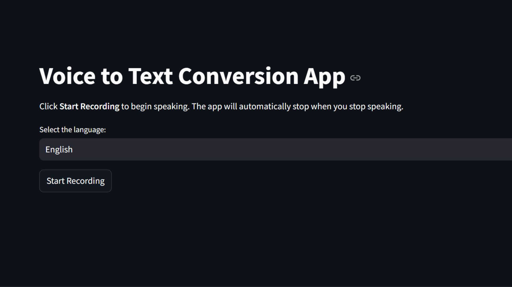

# Voice-to-Text

## Prerequisites
- Python 3.9 or 3.10 higher is required. You can download it from [python.org](https://www.python.org/).

## Setup Instructions

### 1. Clone the Repository
Clone the repository to your local machine.
```bash
git clone https://github.com/anish1204/Voice-to-text-Pyhton.git
```

### 2. Create and Activate a Virtual Environment
Create a virtual environment to manage your project dependencies:
```bash
python -m venv venv
```

Activate the virtual environment:

For Windows:
```bash
venv\Scripts\activate
```

For macOS/Linux:
```bash
source venv/bin/activate
```

### 3. Install Required Packages
Install the necessary Python packages using pip:
```bash
pip install streamlit SpeechRecognition tempfile pydub  pyaudio
```

### 4. Run the Streamlit Application
Start the Streamlit application by running:
```bash
streamlit run main3.py
```
This command will open your default web browser and display the Streamlit app.

## SnapShoot's



### streamlit or SpeechRecognition not found
Ensure that you have activated the virtual environment and installed the packages correctly. Verify installed packages with:
```bash
pip list
```
